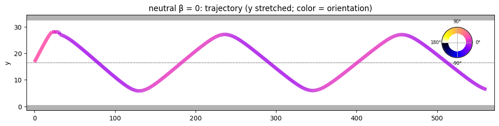
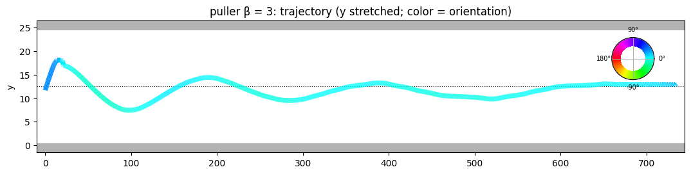
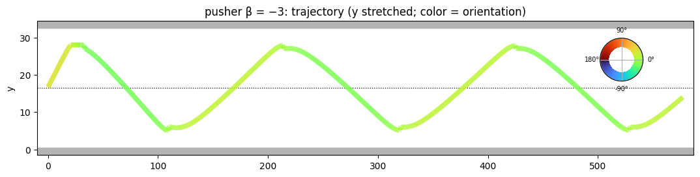
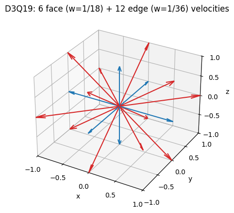
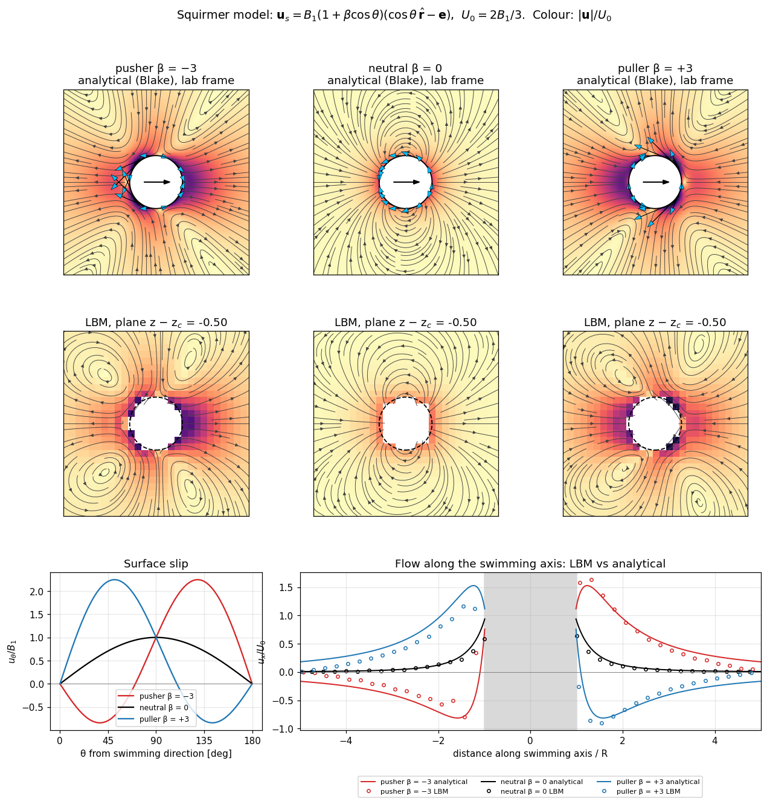
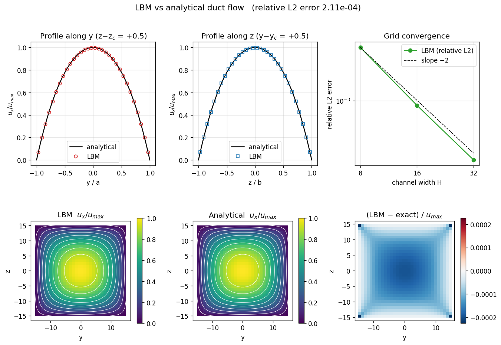
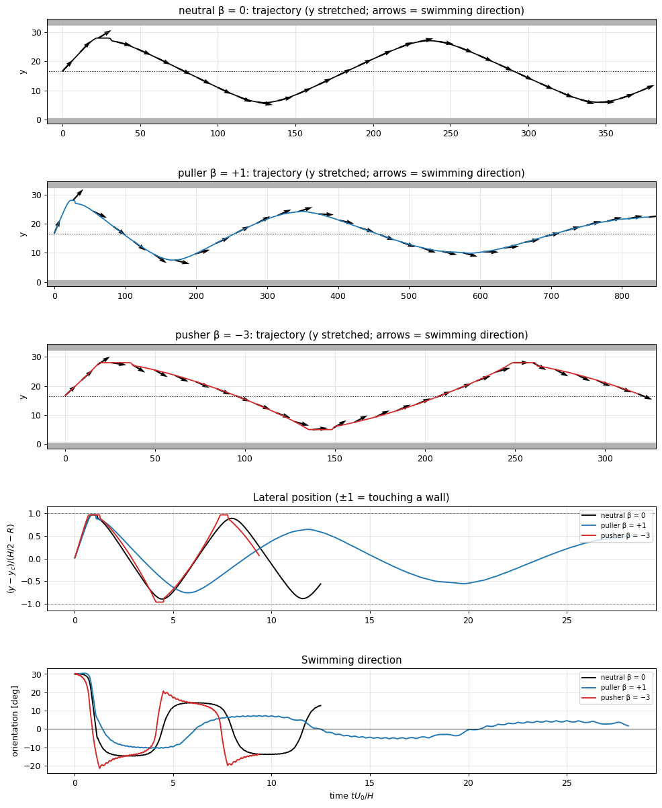
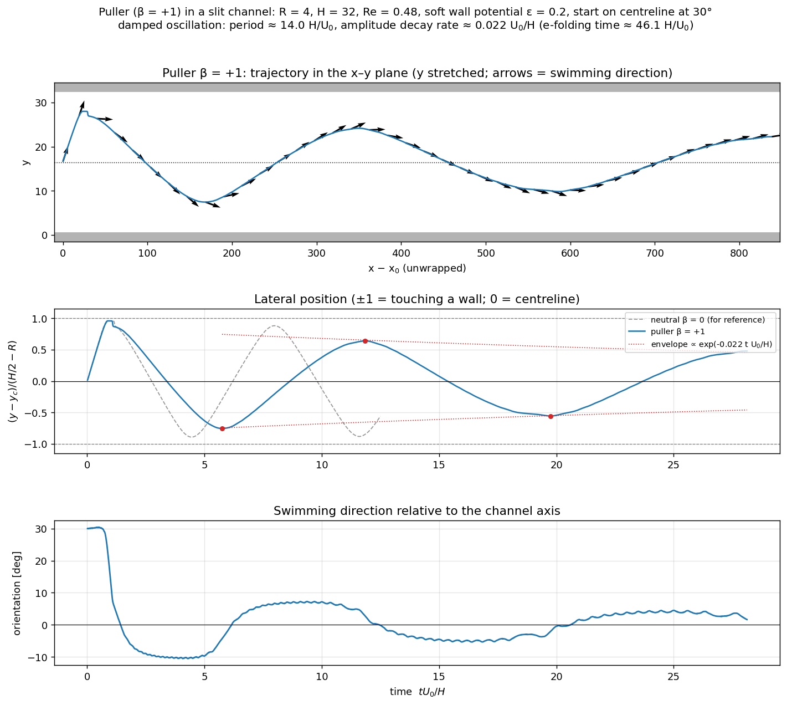

# lbm-squirmer

A compact 3D **lattice Boltzmann** solver (D3Q19, TRT collision) for flow in rectangular channels, with a
fully resolved, self-propelled **spherical squirmer**. It is designed to study the trajectories of
model microswimmers (pushers, pullers, neutral swimmers) between no-slip walls.

<p align="center">
  <br>
  <br>
  <br>
  <em>Trajectories of different squirmer between the walls of a slit channel; Orientations of squirmer are colour coded.</em>
</p>


## `Features`

- D3Q19 lattice, two-relaxation-time (TRT) collision with the "magic" parameter Λ = 3/16
- Guo body forcing (pressure-driven background flow)
- No-slip walls in y and/or z (halfway bounce-back); x is always periodic
- Squirmer with the Blake/Lighthill two-mode slip velocity (parameter β selects pusher, neutral or puller)
- Weak, smooth wall potential with a hard safety gap
- Validated: duct flow to second-order accuracy, bulk swimming speed and near-field flow vs. Blake's solution
- OpenMP parallel; binary VTK output for ParaView


---

## Contents
1. [Start running the simulation](#1-start-running-the-simulation)
2. [Repository layout](#2-repository-layout)
3. [Theory and numerical method](#3-theory-and-numerical-method)
4. [Input file reference](#4-input-file-reference)
5. [Output files](#5-output-files)
6. [Validation](#6-validation)
7. [Tests](#7-tests)
8. [Tutorial notebook](#8-tutorial-notebook)
9. [Units and dimensionless numbers](#9-units-and-dimensionless-numbers)
10. [Limitations and known issues](#10-limitations-and-known-issues)
11. [References](#11-references)

---

## 1. Start running the simulation

**Requirements:** a `C++17 compiler (GCC ≥ 9 or Clang ≥ 10)`, optionally `OpenMP`. For post-processing,
tests: `Python ≥ 3.9` with `numpy`, `scipy`, `matplotlib`, `pytest` and `jupyter`.


```bash
> git clone https://github.com/byjesh1998/LBM_solver_3D.git

> cd LBM_solver_3D

> make                                   # or: cmake -B build && cmake --build build
# which builds bin/lbm_squirmer


> ./bin/lbm_squirmer inputs/duct.in                 # duct flow validation 
> ./bin/lbm_squirmer inputs/channel_neutral.in      # neutral squirmer in a channel
> ./bin/lbm_squirmer inputs/channel_puller.in beta=2 angle=15 prefix=my_run   # override any parameter
```

Any parameter in an input file can be overridden on the command line as `key=value` where key stands for input parameters.
To run it in parallel, set the number of threads with `export OMP_NUM_THREADS=8`.

```bash
> python -m pytest tests -v              # fast tests

> python -m pytest tests -v --runslow    # + trajectory tests

> jupyter notebook notebooks/tutorial.ipynb
```

---

## 2. Repository layout

```
LBM_solver_3D/
├── src/
│   ├── main.cpp              driver: read input, time loop, output
│   └── utils/
│       ├── lattice.hpp       D3Q19 velocities, weights, equilibrium, node types
│       ├── params.hpp/.cpp   parameters, input-file parser
│       ├── lbm.hpp/.cpp      TRT collision + streaming + bounce-back, squirmer coupling
│       ├── squirmer.hpp/.cpp squirmer model and parameters, rigid-body dynamics, wall potential
│       ├── io.hpp/.cpp       VTK, trajectory and state output
│       └── analytic.hpp/.cpp exact duct / plane Poiseuille solutions
├── inputs/                   ready-to-run input files (*.in)
├── outputs/                  simulation results (standard test results are included)
├── postprocessing/
│   └── lbm_post.py           run the solver, read output, exact solutions, plots
├── tests/                    pytest suite (duct flow, bulk squirmer, trajectories)
├── notebooks/tutorial.ipynb  step-by-step tutorial
├── examples/reference_data/  long-run trajectories used by the notebook
├── docs/figures/             figures used in this README
├── Makefile, CMakeLists.txt
└── README.md
```

---

## 3. Theory and numerical method

All quantities are in **lattice units**: $\Delta x = \Delta t = 1$, reference density $\rho_0 = 1$.

### 3.1 Lattice Boltzmann equation

The fluid is described by particle distribution functions $f_i(\mathbf x, t)$ moving with discrete
velocities $\mathbf c_i$, $i = 0,\dots,18$ (D3Q19):

$$
f_i(\mathbf x + \mathbf c_i, t+1) = f_i(\mathbf x, t) + \Omega_i(\mathbf x,t) + S_i(\mathbf x,t).
$$
<table border="0">
<tr>
<td>
  
| group | $\mathbf c_i$ | weight $w_i$ |
|---|---|---|
| rest | $(0,0,0)$ | $1/3$ |
| 6 face neighbours | $(\pm1,0,0), (0,\pm1,0), (0,0,\pm1)$ | $1/18$ |
| 12 edge neighbours | $(\pm1,\pm1,0), (\pm1,0,\pm1), (0,\pm1,\pm1)$ | $1/36$ |

 </td>
<td>


 <br>

</td>
</tr>
</table>


The speed of sound is $c_s^2 = 1/3$. Density and momentum are moments of $f_i$
(with a half-force correction, see 3.3):

$$
\rho = \sum_i f_i,\qquad \rho\mathbf u = \sum_i f_i\,\mathbf c_i + \tfrac12\mathbf F .
$$

The equilibrium is the second-order expansion of the Maxwell–Boltzmann distribution:

$$
f_i^{eq} = w_i\,\rho\left[1 + \frac{\mathbf c_i\cdot\mathbf u}{c_s^2} + \frac{(\mathbf c_i\cdot\mathbf u)^2}{2c_s^4} - \frac{\mathbf u\cdot\mathbf u}{2c_s^2}\right].
$$

In the low-Mach-number limit this recovers the incompressible Navier–Stokes equations

$$
\nabla\cdot\mathbf u = 0,\qquad
\rho\left(\partial_t\mathbf u + \mathbf u\cdot\nabla\mathbf u\right) = -\nabla p + \mu\nabla^2\mathbf u + \mathbf F,
$$

with pressure $p = c_s^2\rho$ and kinematic viscosity

$$
\nu = c_s^2\left(\tau - \tfrac12\right) = \frac{\tau - 1/2}{3}.
$$

### 3.2 Two-relaxation-time (TRT) collision

Each population is split into symmetric and antisymmetric parts with respect to its opposite
direction $\bar i$ ($\mathbf c_{\bar i} = -\mathbf c_i$):

$$
f_i^\pm = \tfrac12\left(f_i \pm f_{\bar i}\right),\qquad
f_i^{eq,+} = w_i\rho\left[1 + \tfrac92(\mathbf c_i\cdot\mathbf u)^2 - \tfrac32 u^2\right],\qquad
f_i^{eq,-} = 3w_i\rho\,\mathbf c_i\cdot\mathbf u ,
$$

and each part relaxes at its own rate:

$$
\Omega_i = -\omega^+\left(f_i^+ - f_i^{eq,+}\right) - \omega^-\left(f_i^- - f_i^{eq,-}\right),\qquad
\omega^+ = \frac1\tau .
$$

$\omega^-$ is fixed by the "magic" parameter

$$
\Lambda = \left(\frac{1}{\omega^+} - \frac12\right)\left(\frac{1}{\omega^-} - \frac12\right) = \frac{3}{16}.
$$

With $\Lambda = 3/16$ the no-slip plane of halfway bounce-back sits exactly half-way between nodes,
independent of $\tau$. This makes TRT exact for plane Poiseuille flow and removes the
viscosity-dependent wall slip of the single-relaxation-time (BGK) model.

### 3.3 Body force (Guo forcing)

A uniform force density $\mathbf F$ (e.g. a pressure gradient $-\mathrm dp/\mathrm dx$) enters as a source term,
split into symmetric and antisymmetric parts:

$$
S_i = \left(1-\tfrac{\omega^+}{2}\right)S_i^+ + \left(1-\tfrac{\omega^-}{2}\right)S_i^-,\qquad
S_i^+ = w_i\left[9(\mathbf c_i\cdot\mathbf u)(\mathbf c_i\cdot\mathbf F) - 3\,\mathbf u\cdot\mathbf F\right],\qquad
S_i^- = 3w_i\,\mathbf c_i\cdot\mathbf F .
$$

### 3.4 Walls: halfway bounce-back

The outermost node layer in y (and optionally z) is solid. A population that would stream from a
fluid node $\mathbf x_f$ into a solid node is reflected back:

$$
f_{\bar i}(\mathbf x_f, t+1) = f_i^*(\mathbf x_f, t) - 2 w_i\,\rho\,\frac{\mathbf c_i\cdot\mathbf u_b}{c_s^2}.
$$

Here $f_i^*$ is the post-collision value and $\mathbf u_b$ the velocity of the boundary at the link midpoint
$\mathbf x_b = \mathbf x_f + \tfrac12\mathbf c_i$ (zero for the walls).
The no-slip plane lies at $\mathbf x_b$, so with fluid nodes $y = 1,\dots,N_y-2$
the walls are at $y = 0.5$ and $y = N_y - 1.5$ and the channel width is

$$
H = N_y - 2 .
$$

### 3.5 Squirmer model

A squirmer is a rigid sphere of radius $R$ with orientation $\mathbf e$ whose surface drives the
fluid with a prescribed tangential slip velocity (Lighthill 1952; Blake 1971). Keeping the first two
modes, with $\cos\theta = \mathbf e\cdot\hat{\mathbf r}$:

$$
\mathbf u_s(\theta) = \left(B_1\sin\theta + B_2\sin\theta\cos\theta\right)\hat{\boldsymbol\theta}
= B_1\left(1 + \beta\cos\theta\right)\left(\cos\theta\,\hat{\mathbf r} - \mathbf e\right),
\qquad \beta = \frac{B_2}{B_1}.
$$

| β | swimmer | far field | propulsion |
|---|---|---|---|
| β < 0 | **pusher** (e.g. *E. coli*) | fluid expelled along the axis, drawn in at the sides | thrust from behind |
| β = 0 | **neutral** (e.g. *Volvox*) | source dipole, decays as $r^{-3}$ | — |
| β > 0 | **puller** (e.g. *Chlamydomonas*) | fluid drawn in along the axis, expelled at the sides | thrust from the front |

In unbounded Stokes flow the swimming speed is $\mathbf U_0 = \tfrac23 B_1\,\mathbf e$, independent of β,
and the lab-frame flow is (Blake 1971)

$$
\mathbf u(\mathbf r) =
B_1\frac{R^3}{r^3}\left[(\mathbf e\cdot\hat{\mathbf r})\hat{\mathbf r} - \frac{\mathbf e}{3}\right]
+B_2\left(\frac{R^4}{r^4} - \frac{R^2}{r^2}\right)\frac{3(\mathbf e\cdot\hat{\mathbf r})^2 - 1}{2}\,\hat{\mathbf r}
+B_2\frac{R^4}{r^4}(\mathbf e\cdot\hat{\mathbf r})\left[(\mathbf e\cdot\hat{\mathbf r})\hat{\mathbf r} - \mathbf e\right].
$$

The $B_2$ term is a force dipole (stresslet) decaying as $r^{-2}$, which dominates hydrodynamic
interactions with walls.

<p align="center"><br>
<em>Top: analytic flow. Middle: LBM flow. Bottom: slip profile and on-axis velocity.</em></p>

### 3.6 Fluid–particle coupling

**Boundary condition.** Lattice nodes inside the sphere are flagged `PARTICLE`. Links from fluid
nodes into the sphere use the bounce-back rule of §3.4 with the local surface velocity

$$
\mathbf u_b = \mathbf U + \boldsymbol\Omega\times\mathbf r_b + \mathbf u_s(\hat{\mathbf r}_b),
\qquad \mathbf r_b = \mathbf x_f + \tfrac12\mathbf c_i - \mathbf X ,
$$

where $\mathbf X$ is the centre (minimum-image convention in periodic directions).

**Hydrodynamic force and torque.** These are obtained by Galilean-invariant momentum exchange
(Wen et al. 2014), summed over all boundary links:

$$
\mathbf F_h = \sum_{\text{links}}\left[\left(f_i^* + f_{\bar i}\right)\mathbf c_i - \left(f_i^* - f_{\bar i}\right)\mathbf u_b\right],
\qquad
\mathbf T_h = \sum_{\text{links}} \mathbf r_b\times\left[\cdots\right].
$$

**Covering and uncovering (Aidun et al. 1998).** When the sphere moves onto a fluid node, the
node's momentum $\sum_i f_i\mathbf c_i$ is given to the particle. When it uncovers a node, the node is
filled with $f_i^{eq}(\bar\rho, \mathbf U + \boldsymbol\Omega\times\mathbf r)$ ($\bar\rho$: mean density of
the fluid neighbours), and that momentum is removed from the particle.

**Rigid-body dynamics.** Explicit Newton–Euler integration each time step:

$$
\mathbf U \leftarrow \mathbf U + \frac{\mathbf F_h + \mathbf F_c + \mathbf F_w}{M},\quad
\boldsymbol\Omega \leftarrow \boldsymbol\Omega + \frac{\mathbf T_h + \mathbf T_c}{I},\quad
\mathbf X \leftarrow \mathbf X + \mathbf U,\quad
\mathbf e \leftarrow \frac{\mathbf e + \boldsymbol\Omega\times\mathbf e}{\lVert\mathbf e + \boldsymbol\Omega\times\mathbf e\rVert},
$$

with $M = \tfrac43\pi R^3\rho_p$ and $I = \tfrac25 M R^2$. With `planar = 1` the motion is restricted
to the x-y plane ($U_z = 0$, $\boldsymbol\Omega = \Omega_z\hat{\mathbf z}$). By symmetry this is an
exact solution of the equations of motion, but it can be unstable in 3D (see §10).

**Mass correction.** Moving-boundary bounce-back on a staircase surface does not conserve mass
exactly. Every `mass_correction_every` steps the deficit is redistributed isotropically,
$f_i \leftarrow f_i + w_i(1 - \langle\rho\rangle)$, over all fluid nodes.

### 3.7 Soft wall potential

The gap between the sphere surface and the wall is only one or two lattice spacings when the
swimmer is close, which the fluid solver cannot resolve (lubrication). A weak, smooth potential
acting along the wall normal prevents unphysical contact. For a surface-to-wall gap $h$:

$$
V(h) = \frac{\varepsilon F_S h_c}{3}\left(1 - \frac{h}{h_c}\right)^3,\qquad
F_w(h) = -V'(h) = \varepsilon F_S\left(1 - \frac{h}{h_c}\right)^2 \quad (h < h_c),
$$

and zero for $h \ge h_c$. The strength is measured in units of the Stokes drag at the swimming
speed, $F_S = 6\pi\mu R U_0$, so ε = 0.2 means at most 20 % of that drag. The force is central, so it
exerts no torque. As a last resort, a hard gap `hmin` is enforced: if $h < h_{min}$ the sphere is
placed back at $h = h_{min}$ and its wall-normal velocity is removed. The number of such
steps is reported as `contacts`.

### 3.8 Algorithm (one time step)

1. For every fluid node: compute ρ, **u**; TRT collision with forcing; push-stream each population;
   on links into solids apply bounce-back and accumulate momentum exchange.
2. Soft wall force → Newton–Euler update of **U**, **Ω**, **X**, **e** → hard gap.
3. Re-map the sphere on the lattice (covering/uncovering with momentum corrections).
4. Every `mass_correction_every` steps: global mass correction.

---

## 4. Input file reference

Input files contain `key = value` lines; `#` starts a comment. The same keys are accepted on the
command line (`key=value`, overriding the file). Booleans accept `0/1`, `true/false`, `yes/no`, `on/off`.

| key | default | description |
|---|---|---|
| `nx`, `ny`, `nz` | 64, 34, 32 | grid size (includes the wall layers) |
| `tau` | 1.0 | relaxation time, ν = (τ − ½)/3; must be > 0.5 |
| `lambda` | 0.1875 | TRT magic parameter Λ |
| `fx`, `fy`, `fz` | 0 | body-force density (background pressure-driven flow) |
| `walls_y` | 1 | no-slip walls at y = 0.5 and y = ny − 1.5 |
| `walls_z` | 0 | no-slip walls at z = 0.5 and z = nz − 1.5 |
| `steps` | 10000 | number of time steps |
| `tol` | 0 | stop when the relative change of Σu_x per `print_every` < tol (no squirmer only) |
| `print_every` | 1000 | console output interval |
| `traj_every` | 50 | trajectory output interval |
| `vtk_every` | 0 | VTK snapshot interval (0: final field only) |
| `mass_correction_every` | 10 | mass-correction interval (0: off) |
| `output_dir`, `prefix` | `outputs`, `run` | output files are `output_dir/prefix_*` |
| `squirmer` | 0 | enable the squirmer |
| `radius` | 4 | squirmer radius R (≥ 4 recommended) |
| `b1` | 0.015 | first squirming mode B₁; U₀ = 2B₁/3 (keep U₀ ≲ 0.02) |
| `beta` | 0 | β = B₂/B₁ (< 0 pusher, > 0 puller) |
| `rho_p` | 1 | particle/fluid density ratio |
| `x0`, `y0`, `z0` | domain centre | initial position (−1 means centre) |
| `angle` | 30 | initial angle from the x-axis in the x-y plane, **must satisfy \|angle\| < 45°** |
| `planar` | 1 | restrict motion to the x-y plane |
| `eps` | 0.2 | wall-potential strength (max force / F_S) |
| `hc` | 2.0 | wall-potential range (lattice units) |
| `hmin` | 0.5 | hard minimum surface-wall gap |

Provided input files:

| file | what it does | run time (1 core) |
|---|---|---|
| `inputs/duct.in` | square-duct Poiseuille flow, validation | ~10 s |
| `inputs/bulk_squirmer.in` | squirmer in a periodic box, validation | ~50 s |
| `inputs/channel_neutral.in` | neutral squirmer (β = 0) in a slit channel | ~11 min |
| `inputs/channel_puller.in` | puller (β = +1) in a slit channel | ~17 min |
| `inputs/channel_pusher.in` | pusher (β = −3) in a slit channel | ~6 min |

---

## 5. Output files

All files are written to `output_dir` with the chosen `prefix`.

| file | content |
|---|---|
| `prefix_final.vtk`, `prefix_<step>.vtk` | legacy binary VTK (structured points): `flag` (0 fluid, 1 wall, 2 particle), `density`, `velocity` |
| `prefix_traj.dat` | columns `t X Y Z ex ey ez Ux Uy Uz Wx Wy Wz Fwall_y Fwall_z`; X is unwrapped along x |
| `prefix_squirmer.dat` | squirmer state at the end of the run (`key value` pairs) |
| `prefix_summary.txt` | diagnostics: mean density, wall force, total body force, L2 error, contacts |
| `prefix_profile_y.dat`, `prefix_profile_z.dat` | centre-line profiles `coordinate u_lbm u_exact` (no squirmer) |

Python readers are in `postprocessing/lbm_post.py`: `read_vtk`, `read_traj`, `read_keyvalue`.

---

## 6. Validation

### 6.1 Duct flow (no squirmer)

Flow in a square duct driven by a body force $G$ is compared with the exact series solution for
$-a<y<a$, $-b<z<b$ (e.g. White, *Viscous Fluid Flow*):

$$
u_x(y,z) = \frac{16 a^2 G}{\mu\pi^3}\sum_{n=1,3,5,\dots}(-1)^{\frac{n-1}{2}}
\left[1 - \frac{\cosh(n\pi z/2a)}{\cosh(n\pi b/2a)}\right]\frac{\cos(n\pi y/2a)}{n^3},
\qquad a = b = \frac{H}{2}.
$$

<p align="center"></p>

| channel width H | relative L2 error |
|---|---|
| 8 | 4.0 × 10⁻³ |
| 16 | 8.8 × 10⁻⁴ |
| 32 | 2.1 × 10⁻⁴ |

The error converges at second order. At steady state the force on the walls equals the total body
force to machine precision, and plane Poiseuille flow (walls in y only) is reproduced to round-off (L2 error 8 × 10⁻¹³, TRT with Λ = 3/16).

### 6.2 Squirmer in a periodic box

With R = 4 and U₀ = 0.01 (Re = 0.48) in a 40³–48³ periodic box:

- A neutral squirmer swims at 0.985 U₀, in a straight line with no rotation (machine precision).
- At this Re, pushers (β = −3) swim at 1.14 U₀ and pullers (β = +3) at 0.86 U₀, consistent with the known effect of fluid inertia.
- The near-field flow agrees with the Blake solution to 15–25 % (relative L2 over 1.25R < r < 3R).
  The remaining difference comes from the coarse sphere, periodic images and finite Re.

### 6.3 Squirmer in a slit channel (H = 32, R = 4, 2R/H = 0.25, Re = 0.48)

| swimmer | behaviour | notes |
|---|---|---|
| neutral, β = 0 | sustained wall-to-wall oscillation | period ≈ 7.4 H/U₀, wavelength ≈ 6.9 H, tilt ±14° |
| puller, β = +1 | damped oscillation towards the centreline | decay rate ≈ 0.02 U₀/H, period ≈ 14 H/U₀ |
| pusher, β = −3 | wall-to-wall motion, pressed against the walls | relies on the hard gap; sensitive to the wall model |

<p align="center"><br>
<em>Neutral, puller and pusher trajectories (reference data, see <code>examples/reference_data/</code>).</em></p>

<p align="center"><br>
<em>Puller β = +1: exponential fit of the decaying oscillation.</em></p>

---

## 7. Tests

```bash
python -m pytest tests -v             # fast: duct flow + bulk squirmer (~1.5 min)
python -m pytest tests -v --runslow   # also the channel-trajectory tests (~15 min)
make test / make test-all             # same, via make
```

| file | what is tested |
|---|---|
| `tests/test_duct_flow.py` | duct L2 error < 5×10⁻⁴; second-order convergence; wall force = body force; mass; exact plane Poiseuille; figure |
| `tests/test_squirmer_bulk.py` | neutral swimming speed; straight swimming; pusher > neutral > puller speed; mass; near-field flow vs Blake; figure |
| `tests/test_trajectories.py` (slow) | neutral squirmer visits both walls; puller oscillation decays; figure |

Figures are written to `tests/output/`.

---

## 8. Tutorial notebook

`notebooks/tutorial.ipynb` walks through the method step by step:
building and running the code, duct flow validation, the squirmer model, bulk validation and channel
trajectories. Short runs are executed live; long-time trajectories are loaded from
`examples/reference_data/` (set `RUN_LONG = True` in the notebook to recompute them).

---

## 9. Units and dimensionless numbers

The physics is set by dimensionless groups; lattice values are chosen to keep the Mach number
small and the sphere resolved.

| quantity | definition | typical value here |
|---|---|---|
| swimming Reynolds number | $Re = 2RU_0/\nu$ | 0.48 |
| confinement | $\kappa = 2R/H$ | 0.25 |
| squirmer parameter | $\beta = B_2/B_1$ | −3 … +3 |
| Mach number | $Ma = U_0/c_s = \sqrt3\,U_0$ | 0.017 |
| time unit | $H/U_0$ | 3200 steps |

To convert to physical units, choose a length scale $\Delta x$ (e.g. $R_{phys}/R$) and match the
viscosity, $\Delta t = \nu_{lat}\,\Delta x^2/\nu_{phys}$. Real microswimmers have $Re \sim 10^{-4}$–$10^{-2}$;
lower $Re$ is reached by increasing τ or decreasing $B_1$, at the cost of longer runs.

---

## 10. Limitations and known issues

- **Near-wall resolution.** When a swimmer is within ~1 lattice unit of a wall, lubrication is not
  resolved; outcomes near walls (especially for pushers) depend on `eps`, `hc`, `hmin` and on R.
  Check key results with a larger radius (R = 6–8) or with an explicit lubrication correction.
- **Out-of-plane instability.** Without `planar = 1`, a swimmer started in the x-y plane may drift
  in z because small lattice asymmetries grow.
- **Finite inertia.** Re ≈ 0.5 by default. Behaviour at Re → 0 may differ quantitatively.
- **Explicit coupling.** Newton–Euler integration is explicit; very light particles
  (ρ_p/ρ_f ≪ 1) can become unstable.
- **Single squirmer**, no restart files, single-node (OpenMP) parallelism.

---

## 11. References

- M. J. Lighthill, *On the squirming motion of nearly spherical deformable bodies through liquids at very small Reynolds numbers*, Commun. Pure Appl. Math. **5**, 109 (1952).
- J. R. Blake, *A spherical envelope approach to ciliary propulsion*, J. Fluid Mech. **46**, 199 (1971).
- T. Ishikawa, M. P. Simmonds, T. J. Pedley, *Hydrodynamic interaction of two swimming model micro-organisms*, J. Fluid Mech. **568**, 119 (2006).
- A. J. C. Ladd, *Numerical simulations of particulate suspensions via a discretized Boltzmann equation*, J. Fluid Mech. **271**, 285 (1994).
- C. K. Aidun, Y. Lu, E.-J. Ding, *Direct analysis of particulate suspensions with inertia using the discrete Boltzmann equation*, J. Fluid Mech. **373**, 287 (1998).
- Z. Guo, C. Zheng, B. Shi, *Discrete lattice effects on the forcing term in the lattice Boltzmann method*, Phys. Rev. E **65**, 046308 (2002).
- I. Ginzburg, F. Verhaeghe, D. d'Humières, *Two-relaxation-time lattice Boltzmann scheme*, Commun. Comput. Phys. **3**, 427 (2008).
- B. Wen, C. Zhang, Y. Tu, C. Wang, H. Fang, *Galilean invariant fluid–solid interfacial dynamics in lattice Boltzmann simulations*, J. Comput. Phys. **266**, 161 (2014).
- L. Zhu, E. Lauga, L. Brandt, *Low-Reynolds-number swimming in a capillary tube*, J. Fluid Mech. **726**, 285 (2013).
- T. Krüger et al., *The Lattice Boltzmann Method: Principles and Practice*, Springer (2017).
- F. M. White, *Viscous Fluid Flow*, McGraw-Hill.

---


             ┌───────────────-┐
             │ f distributions│
             └───────┬───────-┘
                     ↓
             calculate rho, u
                     ↓
                 collision
                     ↓
                 streaming
                     ↓
           ┌─────────┴─────────┐
           ↓                   ↓
        fluid cell          solid cell
           ↓                   ↓
      move normally       bounce back
                               ↓
                         force/torque


                         LBM
                          │
       ┌──────────────────┼──────────────────┐
       │                  │                  │
     FLUID             BOUNDARIES         PARTICLE
       │                  │                  │
       ↓                  ↓                  ↓
   f, rho, u          flag, wallForce       sq
       │                  │                  │
       └──────────────┬───┴──────────────────┘
                      ↓
                    step()
                      ↓
              fluid-particle coupling


              
